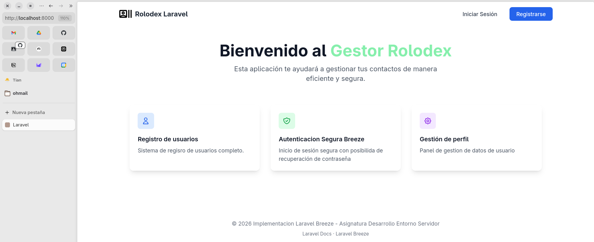
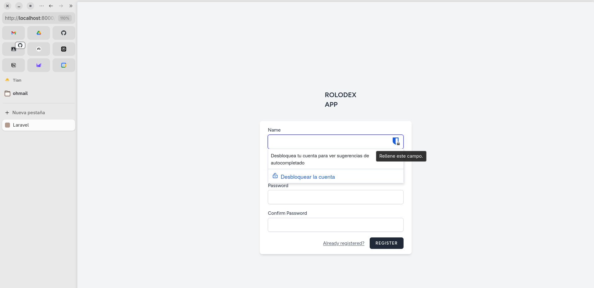
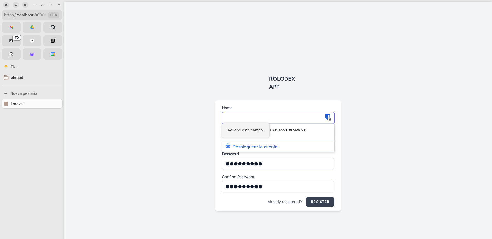
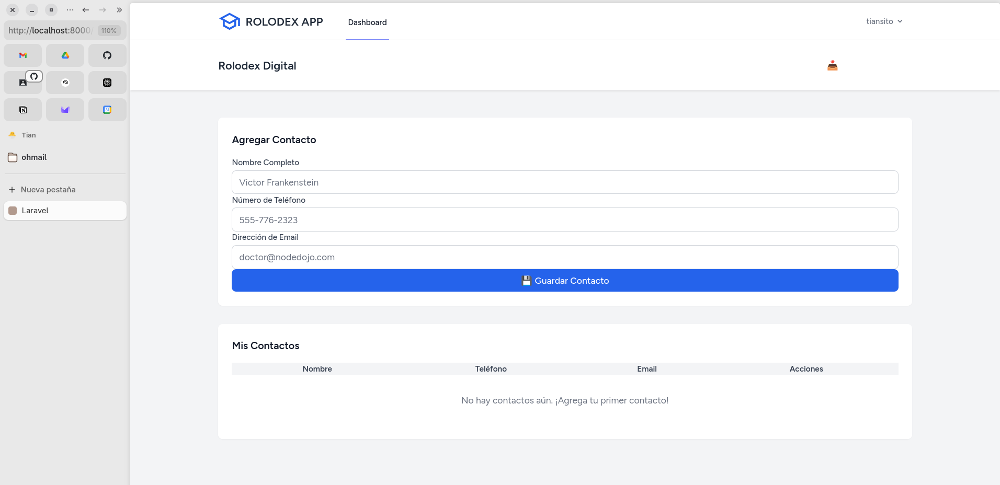
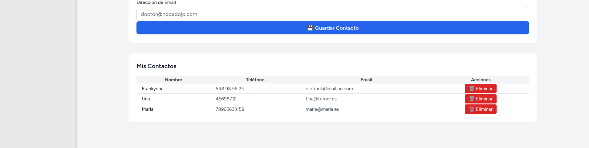
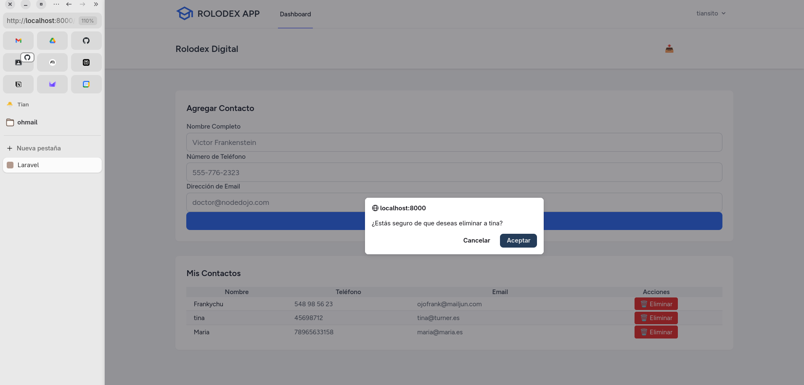
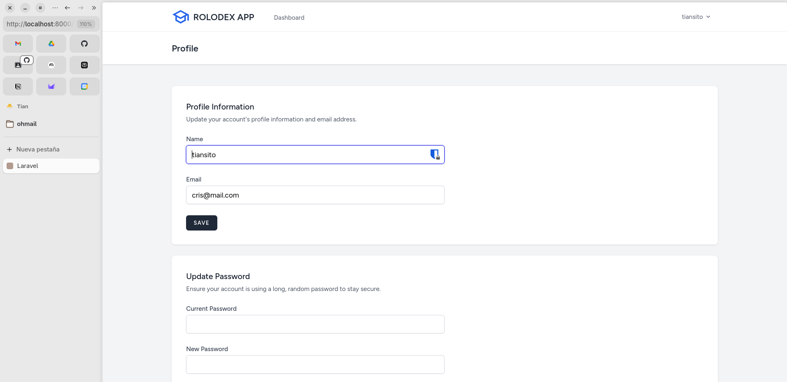

# Rolodex Digital con Registro y Autenticacion de Usuario

## Descripcion del Proyecto

Se trata de una herramienta de gestion de contactos integrada con un sistema de autenticacion de usuarios, permitiendo que cada usuario tenga su propia agenda digital de contactos.

La aplicacion permite a los usuarios:

- Registrarse e iniciar sesion de forma segura
- Agregar, visualizar y eliminar contactos personales
- Exportar sus contactos a formato CSV para uso externo
- Gestionar informacion de perfil de usuario
- Interfaz responsive adaptada a dispositivos moviles y desktop

Este proyecto fue desarrollado con fines educativos en el CIFP Francesc de Borja Moll como parte del programa de formacion en desarrollo web   

## Stack Tecnologico

### Backend
- **Laravel 12.40.2**: Framework PHP moderno para aplicaciones web
- **PHP 8.2.30**: Lenguaje de programacion servidor
- **MySQL 8.0.44**: Sistema de gestion de base de datos relacional

### Frontend
- **Blade Templates**: Motor de plantillas nativo de Laravel
- **Tailwind CSS 3.1.0**: Framework CSS utility-first para estilos
- **Alpine.js 3.4.2**: JavaScript ligero para interactividad
- **Vite 7.0.7**: Herramienta de construccion y bundling moderno

### Herramientas y Dependencias
- **Composer 2.x**: Gestor de dependencias PHP
- **npm**: Gestor de paquetes JavaScript
- **Docker & Docker Compose**: Contenedorizacion y orquestacion

### Desarrollo
- **Laravel Breeze 2.3.8**: Stack de autenticacion preconfigurado
- **Laravel Pint 1.26.0**: Formateador de codigo PHP
- **PHPUnit 11.5.45**: Framework de testing para PHP
- **Laravel Sail 1.48.1**: Ambiente de desarrollo con Docker

## Estructura de Directorios

```
7-rolodex-con-registro-y-autenticacion-de-usuario-Cristian-VP/
│
├── app/                                    # Codigo de la aplicacion
│   ├── Http/
│   │   ├── Controllers/
│   │   └── Requests/
│   ├── Models/
│   ├── Providers/
│   └── View/
├── bootstrap/                              # Archivos de inicializacion
│
├── config/                                # Archivos de configuracion
│
├── database/                              # Migraciones y seeds
├── docker/                                # Configuracion de Docker
├── public/                                # Archivos publicos accesibles
├── resources/                             # Archivos de recursos
├── routes/                                # Definicion de rutas
├── storage/                               # Archivos generados en tiempo de ejecucion
├── tests/                                 # Pruebas automatizadas
├── vendor/                                # Dependencias de Composer

```
## Caracteristicas Principales

### 1. Sistema de Autenticacion
- Registro de nuevos usuarios
- Login seguro con encriptacion de contrasenas
- Recuperacion de contrasena
- Verificacion de email (opcional)
- Gestion de sesiones

### 2. Rolodex Digital
- Formulario para agregar contactos con validacion
- Tabla sincronizada en tiempo real
- Eliminacion de contactos con confirmacion
- Listado completo de todos los contactos del usuario

### 3. Exportacion de Datos
- Descarga de contactos en formato CSV
- Incluye nombre, telefono, email y fecha de creacion
- Archivo descargable con timestamp

### 4. Gestion de Perfil
- Actualizacion de informacion de usuario
- Cambio de contrasena
- Eliminacion de cuenta

### 5. Diseño Responsive
- Interfaz adaptada a dispositivos moviles
- Layout fluido con Tailwind CSS
- Navegacion intuitiva

## Flujo de Uso de la Aplicacion

### 1. Pagina de Bienvenida


La pagina principal presenta la aplicacion y opciones para iniciar sesion o registrarse.

### 2. Registro de Usuario


Formulario de registro donde los nuevos usuarios pueden crear una cuenta con correo electronico y contrasena.

### 3. Error de Validacion en Registro


Sistema de validacion que muestra errores en tiempo real si los datos ingresados no son validos.

### 4. Login de Usuario


Pantalla de autenticacion donde usuarios registrados pueden iniciar sesion.

### 5. Dashboard Principal - Rolodex


Interfaz principal con:
- Formulario de entrada de contactos (lado izquierdo)
- Tabla de contactos registrados (lado derecho)
- Boton de exportacion CSV en la cabecera
- Validacion de formulario en tiempo real

### 6. Contactos Agregados


La tabla muestra todos los contactos agregados por el usuario de forma sincronizada.

### 7. Eliminacion de Contacto


Confirmacion para eliminar un contacto antes de proceder.

### 8. Gestion de Perfil de Usuario


Seccion donde el usuario puede actualizar su informacion personal y contrasena.


## Validaciones

### Validacion de Contactos
```
- full_name: requerido, string, maximo 255 caracteres
- phone_number: requerido, string, maximo 20 caracteres
- email_address: requerido, email valido, maximo 255 caracteres
```

### Validacion de Registro
```
- name: requerido, string, maximo 255 caracteres
- email: requerido, email unico, maximo 255 caracteres
- password: requerido, minimo 8 caracteres, confirmacion
```

## Seguridad

### Medidas Implementadas
- Hash de contrasenas con algoritmo bcrypt
- CSRF Protection en todos los formularios
- Autorizacion por usuario (solo acceso a propios contactos)
- Validacion de entrada en servidor y cliente
- Middleware de autenticacion en rutas protegidas
- Variables sensibles en archivo .env
